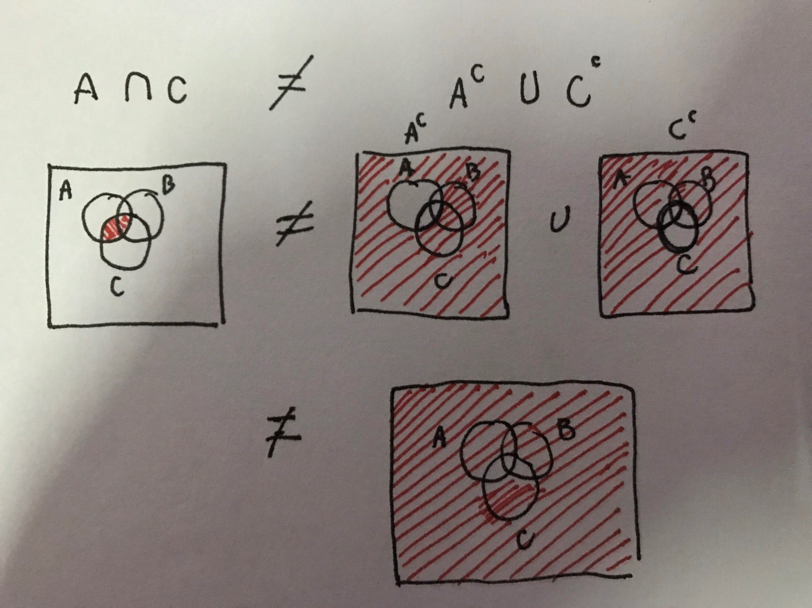
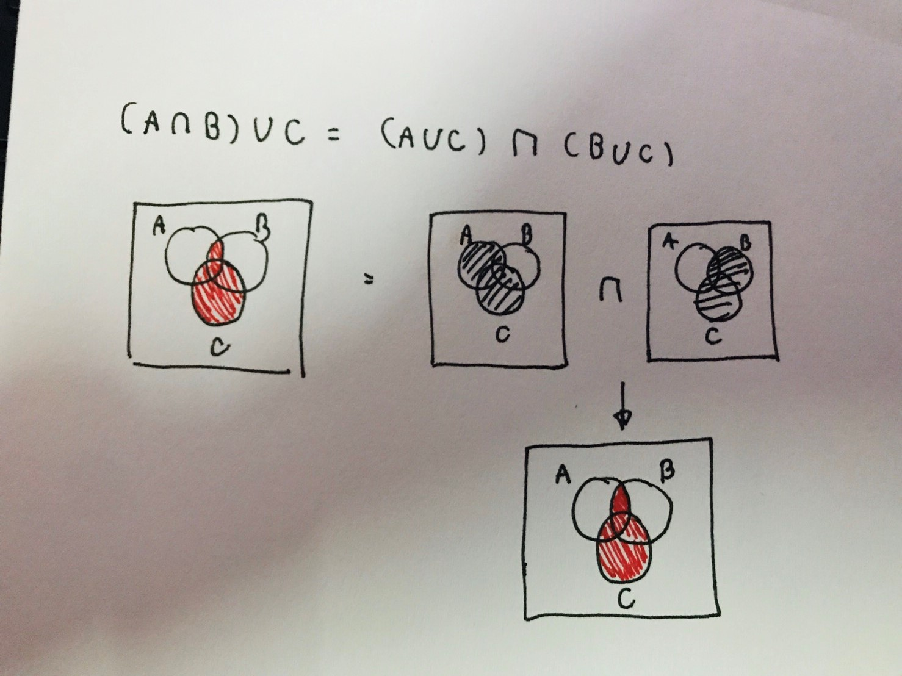

# Probability Quiz

## Outline

1. A ⊆ A `: answer --> true`
2. Ø ⊆ Ø `: answer --> true`
3. A ⊆ B และ B ⊆ C แล้ว A ⊆ C `: answer --> true`
4. A ⊆ B และ B ⊆ A แล้ว A = B `: answer --> true`
5. A ⊆ B และ A ⊆ B เท่านั้น `: answer --> false`

## Setlab

### (1)

1. เซตของเส้นตรงที่ขนานกับแกน Y `--> ไม่จำกัด`
2. เซตของจำนวนพนักงานในบริษัท `--> จำกัด`
3. เซตของไฟฟ้าที่ใช้ในบริษัทในแต่ละเดือน `--> จำกัด`
4. เซตของค่าใช้จ่ายแต่ละส่วนในบริษัท `--> จำกัด`

### (2)

1. A ={x| x2 - 1 = 0} `--> A = {-1, 1}`
2. B = {x| x เป็นตัวอักษรของคำว่า “probability”} `--> B = {p, r, o, b, a, i, l, t, y}`
3. C = {x | x เป็นจำนวนเดือนใน 1 ปี} `--> C = {12}`

### (3)

1. A = {1,2} B = {1,2,3,4} C ={3,4} D = {4,5,6,7}

- A ⊆ B --> `true`
- A = B --> `false`
- B ~ D --> `true`
- D ⊆ C --> `false`
- C ⊆ D --> `false`
- A ≠ B --> `true`

### (4)

1. A = {1,2,3} B = {3,4,5,6,7} C = {5,7,9} U= {1,2, …, 10}
   - A U B U C = {1, 2, 3, 4, 5, 6, 7, 9}
   - A ∩ B ∩ C = Ø
   - (B ∪ C)' = {1, 2 ,8, 10}
   - (A - B)' = {3, 4, 5, 6, 7, 8, 9, 10}

### (5)

1. (A ∩ C) = A' ∪ C'  
   
2. (A ∩ B) ∪ C = (A U C) ∩ (B U C)  
   
